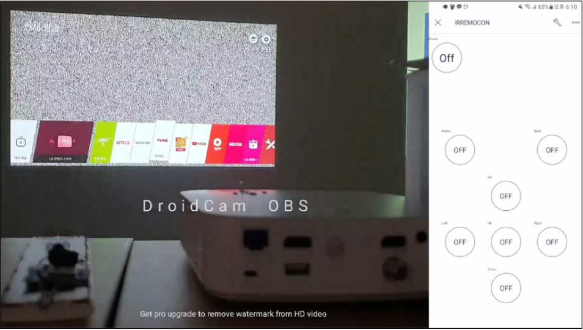
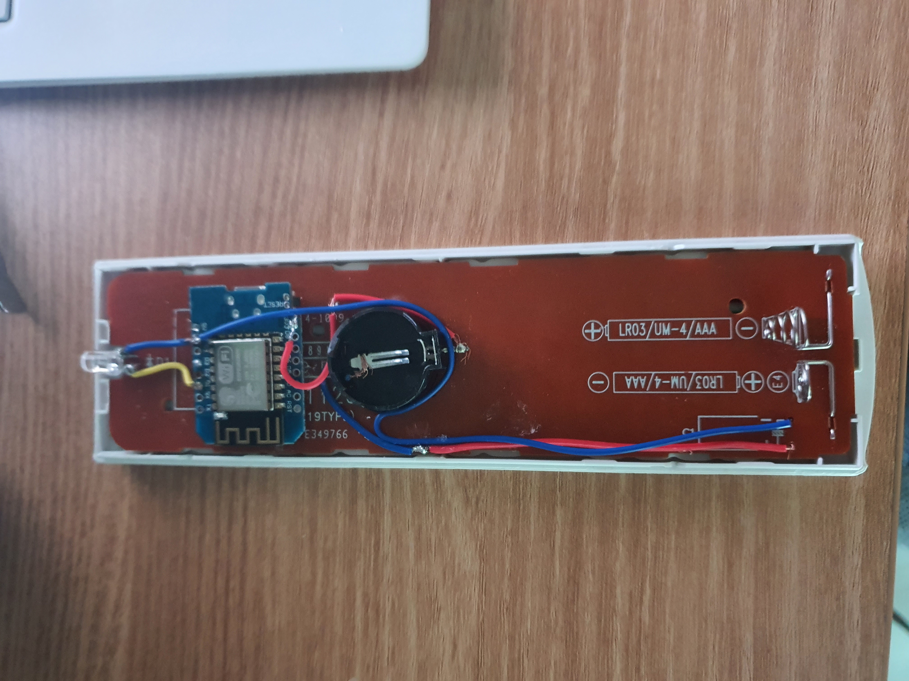

# IR remote replayer chip

BoB 10th B-Beam-BoB Team Project's sub-Project By R3dzone

BoB 10기 B-Beam-BoB 팀프로젝트 중 진행한 리모컨 IR 신호를 캡쳐해서

원격에서 제어 할 수 있도록 한 서브 프로젝트 입니다!

좌: 제작한 칩과 동작 모습 / 우: Blynk 제어 어플리케이션

제작한 chip을 리모컨에 장착한 모습

## 코드 목록

- chip.ino
    - chip의 메인 코드입니다. Wi-Fi 탐색 및 연결, IR 신호 송신, Blynk와 통신 등의 기능이 작성되어 있습니다.

## 기여자

**R3dzone**: [https://github.com/r3dzone](https://github.com/r3dzone/)
